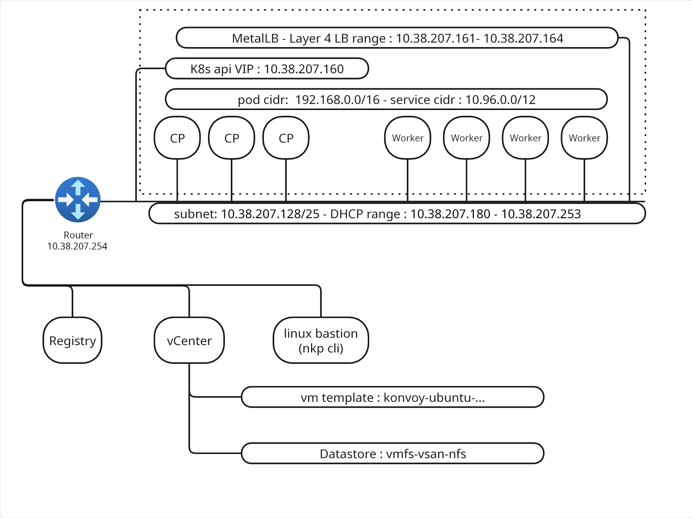

# Nutanix Kubernetes Platform - Quickstart Guide

!! this needs to be reworked for ubuntu/vsphere environment

## TL;DR

* create linux jumphost with docker-ce
* git clone this repo 
* run scripts in numerical order

## Network Diagram

Below an example of NKP on vsphere deployment diagram.
Ip ranges are provided as example.

## Support and Disclaimer

These code samples are intended as standalone examples. Please be aware that all public code samples provided by Nutanix are unofficial in nature, are provided as examples only, are unsupported, and will need to be heavily scrutinized and potentially modified before they can be used in a production environment. All such code samples are provided on an as-is basis, and Nutanix expressly disclaims all warranties, express or implied. All code samples are © Nutanix, Inc., and are provided as-is under the MIT license (<https://opensource.org/licenses/MIT>).
