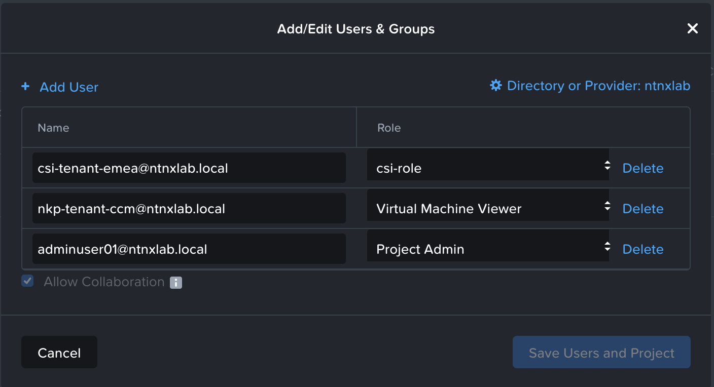

# Least priviledged roles

## Roles definitions

### create csi-role

role name : csi-role
Role details : 49 Operations in role

* AHV VM
    * Create Virtual Machine Disk
    * Delete Virtual Machine Disk
    * View Existing Virtual Machine
    * View Virtual Machine
    * View Virtual Machine Disk
* Category
    * Create Category
    * View Category
* Cluster
    * View Cluster
* Domain Manager(Prism Central)
    * View Domain Manager
    * View Prism Central
* Files
    * Clone File Server Share
    * Create File Server Share
    * Create File Server Share
    * Create File Server Share Snapshot
    * Create File Server Share Snapshot
    * Delete File Server Share
    * Delete Snapshot File server Share
    * Delete Snapshot File server Share
    * Update File Server Share
    * View File Server
    * View File Server Share
    * View File Server Share
    * View Snapshot File server Share
    * View Snapshot File server Share
* Host
    * View Host
* iSCSI Client
    * Update External iSCSI Client
    * View External iSCSI Client
* Recovery Point
    * Create Recovery Point
    * Delete Recovery Point
    * Restore Recovery Point
    * View Recovery Point
* Storage Container
    * Update Container Disks
    * View Storage Container
* Task
    * View Task
* Volume Group
    * Attach Volume Group To AHV VM
    * Attach Volume Group To External iSCSI Client
    * Create Volume Group
    * Create Volume Group Disk
    * Delete Volume Group
    * Detach Volume Group From AHV VM
    * Detach Volume Group From External iSCSI Client
    * Update Volume Group Categories
    * Update Volume Group Details
    * Update Volume Group Virtual Disks
    * View Volume Group
    * View Volume Group Details
    * View Volume Group Disks
    * View Volume Group iSCSI Attachments
    * View Volume Group VM Attachments

### CCM

in PC Project assign ccm user with role 'Virtual Machine Viewer'

### CSI user

Create authorization policy with role 'csi-role' and restrict as needed
* set cluster
* set storage container
* !! leave "Domain Manager" to "All Domain Manager"
* AHV VM to "In project : project name"
* Category - leave on "All Category"
* Cluster - Leave on "All Cluster" (in order to see PC)